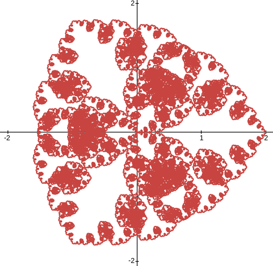

So, I discovered a fractal. Multiple fractals actually. What are they, what are their properties? 

# The Weierstrass function

Everything starts with the Weierstrass function. In order to understand what it is and why we care about it in the first place, let's talk about continuity and differentiability.

We say a function is continuous when we can draw its line graph in a single stroke, without letting the pencil off the paper. In more rigorous terms, a function $f$ is continuous at the point $c$ when the limit of $f(x)$ as $x$ tends to $x$ is equal to $f(c)$. This neatly encapsulates the intuition we have of continuity. However notice that the exact definition only tells us about continuity on a single point. We say a function is continuous on a line segment if it continuous on all of its points. Similarly, a function is continuous on $\mathbb{R}$, the set of real numbers, if it is continuous on each and every real number.

On the other hand, we say a function is differentiable when it has a computable, finite slope. In more rigorous terms, a function $f$ is differentiable at the point $c$ when its growth rate converges.

$$
f'(a)=\lim _{x\to a}{\frac {f(x)-f(a)}{x-a}}
$$

Notice once again that the definition only tells us about differentiability on a single point. Again, a function is differentiable on $\mathbb{R}$ when it is differentiable on all real numbers.

It it worth to be noted that differentiability implies continuity. A function can only be differentiable if it is already continuous. The reciprocal is not necessarily true.

As a counter-example, we can look at the function $|x|$. It is continuous on $\mathbb{R}$. The left-hand part is differentiable and its derivative is -1, the right-hand part is differentiable and its derivative is 1. What happens on 0 is quite literally an edge case: the derivative can not exist, because the growth rate converges towards a different value depending on the side we compute it on.

![[abs.png]]

This example has a single discontinuous point. And if you try to come up with your own counter-examples, you will likely end up with continuous functions with a few undifferentiable points. This begs the question: can a continuous function be not differentiable on a whole line segment, or even on all $\mathbb{R}$? Mathematicians who originally came up with counter-examples like ours thought that no, undifferentiability of continuous functions were localized to some points, that those points couldn't be *everywhere*. However, they were proven wrong by the Weierstrass function.

What's this function? It is defined as the sum of infinitely many sines. The frequency of those sines grows following $4^n$, and those sines are weighted following $\frac{1}{2^n}$.

$$
W(x)=\sum _{n=0}^{\infty }\frac{\cos(4^{n}\pi x)}{2^{n}}
$$

And this function is very special, it is continuous everywhere on $\mathbb{R}$, but differentiable *nowhere*. Now let's prove why this is the case. Continuity and differentiability both behave nicely when building functions from other ones. The sum of continuous functions is continuous as well, and the sum of differentiable functions is differentiable as well. The is also true for the product of functions, and even for composition. This allows us to easily prove many of the usual functions are neatly continuous and differentiable, like polynomials or instance. The subtle property that will play a crucial role is that a *finite* sum of functions is continuous or differentiable. When we have an infinite sum like with the Weierstrass function, things are trickier.

Looking back at our function's definition, we can look at the different sines it's made up of to understand how the partial sums converge towards the whole function. We know the cosinus function is bounded between -1 and 1. That means that every term's absolute value is bounded by $\frac{1}{2^n}$. Therefore, the difference between the partial sums and the complete function is always uniformly bounded by the sum of $\frac{1}{2kn}$ for k going from n to infinity. So this difference is a function whose bounds converges towards 0. We call this uniform convergence. And it's the most important hypothesis of the theorem that proves the Weierstrass function is continuous.

On the other hand, if we compute the derivatives of those sines, we notice that the $4^n$ inside is taken out. Their derivatives are equal $-2^n\sin(4^nx)$. We can see the exponential factor $2^n$ making the terms blow up to infinity if we try computing the derivative. This is visible when we look at the graphs of those sines: although they get smaller in amplitude, their frequencies grow even faster than their amplitudes do. So obviously their slopes grow larger exponentially, and can't be summed. It is because the exponential term inside the cos grows exponentially faster than the exponential factor damping the amplitudes that we get this result.

And this explains why the Weierstrass function is continuous everywhere and differentiable nowhere. We can zoom to any point of its graph, and always see more details. It is impossible to even tell if the function is going up or down at any given point.

Before we move on to the next part, I have to admit that I lied. Actually the official definition of the Weierstrass function is a bit more general. It is defined with general parameters $a$ and $b$, and the function I talked about is the specific case when $a=4$ and $b=\frac{1}{2}$.

$$
W(x)=\sum _{n=0}^{\infty }a^{n}\cos(b^{n}\pi x)
$$

# Building the fractal

So, we've seen the Weierstrass function is a sum of sines, with different frequencies and different amplitudes.

We have $e^{ix}=\cos x+i\sin x$. Sine and cosine are dual functions in some way. And since this is a linear equality, it can apply to sums of sines and cosines as well. For example:

$$
e^{ix}+\frac{1}2 e^{4ix}=\cos t+\frac{1}{2}\cos\left(4t\right)+i\sin t+i\frac{1}{2}\sin\left(4t\right)
$$

When we represent such functions in the complex plane, we get figures called *epicycles*. The point described by $f(x)$ moves along a cyclical shape. The simplest epicycle is a boring circle, corresponding to the function $e^{ix}$. The epicycle corresponding to $e^{ix}+\frac{1}2 e^{4ix}$ looks like this:

![[simple_epicycle.png]]

An interesting property of epicycles is their symmetry. When the epicycle is the sum of a real cosine and an imaginary sine, the figure is symmetrical with respect to the horizontal axis. Why? On one hand cos is symmetric, meaning that for any $x$, $\cos(-x)=\cos(x)$. On the other hand sin is antisymmetric, meaning that for any $x$, $\sin(-x)=-\sin(x)$. Therefore when tracing the figure the other way around, we simply trace the same figure with its vertical axis (determined by sines) flipped.

And of course, we can do the same with the Weierstrass function. We can see it as the real part of a complex function that we'll call $\tilde W$:

$$
\tilde W(x)=\sum _{n=0}^{\infty }a^{n}e^{ib^{n}\pi x}
$$

Where

$$
W(x)=\text{Re}(\tilde W(x))
$$

And by plotting this complex function with the parameters $a=\frac{1}2$ and $b=4$, we get our new fractal. I'll name it quite naturally the *Weierstrass fractal*.

The function is impossible to truly represent because of its infinite sum. The representations used here use a partial sum with $n$ from $0$ to $7$.

Plugging other values for $a$ yields different figures. When $a$ is an integer, we get neat figures that seem to have $a-1$ axes of symmetry.

![[weierstrass_2.png]]

![[weierstrass_4.png]]

Changing $b$ only changes the size and thickness of the fractal.

Well, to be honest, during the writing of this video I found [a blog post](https://risingentropy.com/2018/11/27/fractals-and-epicycles/) about epicycle fractals which also features this fractal. Here's an animation from the post:

In order to make up for my utter lack of originality, I will go further and explore mathematical properties of this fractal.
# Symmetry

The first property we can explore is its symmetry. We can see the fractal has radial symmetry with respect to 3 axes, and central symmetry with angle $\frac{2\pi}3$. In order to properly demonstrate this, we have to formalize it. 

Having this symmetry means a point belongs to the line graph if and only if the same point rotated by $\frac{2\pi}3$ belongs to the line graph as well. In the complex numbers, we have a simple way of writing rotations: we multiply with unit complex numbers. The number $1$ represents as rotation of 0 radians. Multiplying by $i$ representes a rotation of $\frac\pi{2}$ radians, or one quarter of a circle. Multiplying by $-1$ is a rotation of $\pi$ radians or half a cirle. And in our case, a rotation of a third of a circle corresponds to multiplying by $e^{\frac{i2\pi}3}$, often noted $j$. This number has some useful properties: $j^3=1$, $j^4=j$, etc.

So we have to show that if a point $p$ exists in the line graph, meaning there is a number $x$ such that $\tilde W(x)=p$ if and only if $jp$ exists, meaning there is a number $x'$ such that $\tilde W(x')=jp$. Since the complex Weierstrass function is a periodic function, we can expect that shifting the function by a third of its period yields the same points rotated by a factor of $j$:

$$
\tilde W(x+\frac{1}3=j\tilde W(x)
$$

Let's prove this. For any $x$:

$$
\tilde W(x+\frac{1}3)=\sum _{n=0}^{\infty }\frac{e^{i4^{n}\pi 2(x+\frac{1}3)}}{2^{n}}
$$

Factoring out the additional term:

$$
\tilde W(x+\frac{1}3)=\sum _{n=0}^{\infty }\frac{e^{i4^{n}2\pi x+i\frac{4^{n}2\pi}3}}{2^{n}}
$$

We can use the properties of the exponential to take out that term:

$$
\tilde W(x+\frac{1}3)=\sum _{n=0}^{\infty }\frac{e^{i4^{n}2\pi x}e^{i\frac{4^{n}2\pi}3}}{2^{n}}
$$

That multiplicative term looks suspiciously like $j$. By taking out the $4^n$ exponential, it's even clearer:

$$
e^{i\frac{4^{n}2\pi}3}=({e^{i\frac{2\pi}3}})^{4^n}
$$

Thus:

$$
e^{i\frac{4^{n}2\pi}3}=j^{4^n}
$$

Remember when we said that $j^4=1$? Well it also means that ${j^4}^4=j^4=j$. In fact, by recursion, this is true for any integer. Thus:

$$
e^{i\frac{4^{n}2\pi}3}=j
$$

Going back to our equations on the complex Weierstrass function:

$$
\tilde W(x+\frac{1}3)=\sum _{n=0}^{\infty }\frac{je^{i4^{n}2\pi x}}{2^{n}}
$$

Thus:

$$
\tilde W(x+\frac{1}3)=j\sum _{n=0}^{\infty }\frac{e^{i4^{n}2\pi x}}{2^{n}}
$$

Meaning we finally have:

$$
\tilde W(x+\frac{1}3)=j\tilde W(x)
$$

Therefore proving the central symmetry.

Now the axial symmetry gets easier: we only have to prove it's symmetrical with respect to the horizontal axis. The central symmetry will ensure the figure is symmetric with respect to the two other axes, .

But remember, that the fractal is an epicycle, with a real part composed of cosines and an imaginary part composed of sines. It is thus symmetrical with respect to the horizontal axis, and thus symmetrical with respect to all 3 axes.

The same reasoning can be applied for other values of $a$. For $a=5$, the figure has 4 axes of symmetry. In fact, the fractal has $a-1$ axes of symmetry, for all positive integers $a$.

# Dimension

An interesting property of fractals is that they have a dimension that's typically not an integer. Lines are of dimension 1, surfaces have dimension 2, volumes have dimension 3. But fractals sitting in a 2D plane typically have a dimension of somewhere between 1 and 2, and fractals sitting in a 3D volume between 2 and 3.

There are two definitions of a fractal's dimension.

| a      | d      |
| ------ | ------ |
| 2      | 1.0936 |
| 3      | 1.5485 |
| 4      | 1.7503 |
| 5   | 1.8425 |
| -4  | 1.7623 |
| -3     | 1.5521 |
| -2     | 1.0762 |
 
 There is a second way of considering dimension: the Hausdorff dimension. It is more formal, but also harder. I tried finding consistent patterns of self-similarity, but I haven't succeeded so far.

