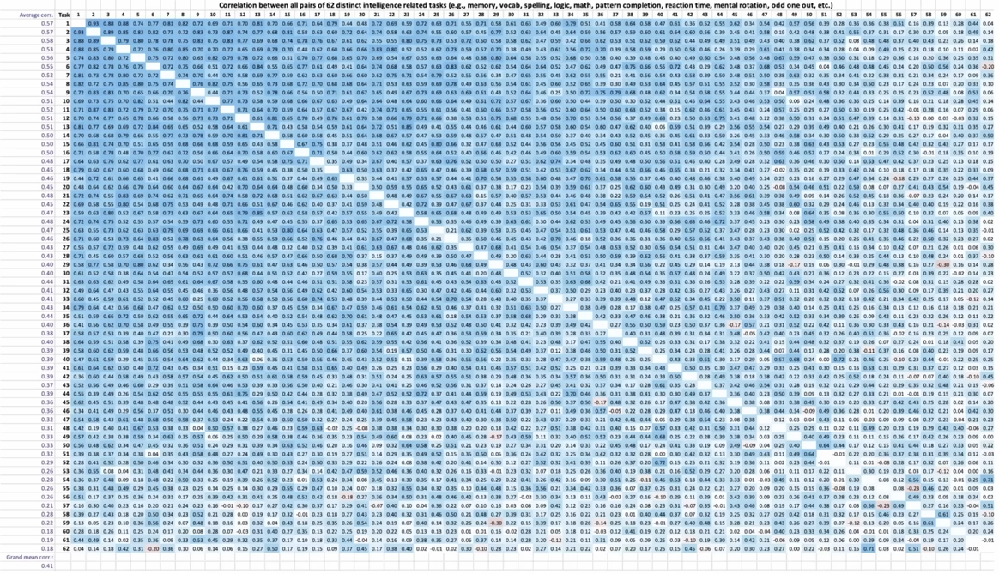

The general intelligence factor, *g* for short, is a latent variable that explains about half of the variance in intelligence.

Its construction stems from the positive manifold—the fact that cognitive subtest results are positively correlated.

It is constructed through [[Factor analysis]], often as the first unrotated factor. It is a population-level latent variable and is not directly measurable for individuals. It is however possible to construct [[IQ]] tests that are heavily *g*-loaded, with correlations over 0.9.

Some items are more *g*-loaded than others. Strongly *g*-loaded subtests include Raven's progressive matrices, matrix reasoning, backward digit span memorization—while weakly *g*-loaded subtests include simple reaction time, spelling, forward digit span memorization.

*g* is positively correlated with brain volume, even when controlling for height[^1].

[^1]: [McDaniel (2005). *Big-brained people are smarter: A meta-analysis of the relationship between in vivo brain volume and intelligence*](https://psycnet.apa.org/record/2005-07858-002)
